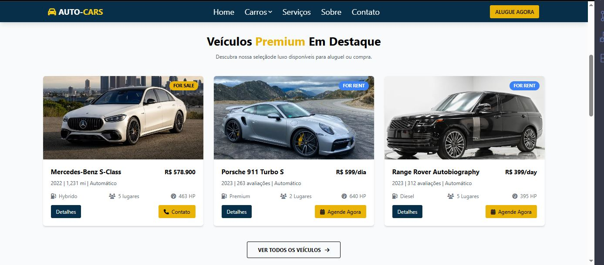

# 🚗 AUTO-CARS – Landing Page  

Uma **landing page responsiva** para aluguel e venda de carros de luxo, construída com **HTML**, **CSS** e **JavaScript**.  
O projeto traz um design moderno, animações suaves e uma interface totalmente otimizada para **mobile e desktop**.  

---

## 🌐 Visualize o projeto  
👉 [Ver Projeto Online](https://damasiodev.github.io/Auto-Cars-Project/)  

---

## 🛠️ Tecnologias Utilizadas  
- **HTML5** → Estrutura semântica da página  
- **CSS3** + **Tailwind CSS** → Estilização e responsividade  
- **JavaScript (Vanilla)** → Menu mobile, scroll suave e interatividade  
- **Font Awesome** → Ícones  
- **Google Fonts** → Fontes personalizadas  

---

## ✨ Funcionalidades  
✔️ Design responsivo (mobile-first)  
✔️ Menu interativo com dropdown e versão mobile  
✔️ Scroll suave para navegação entre seções  
✔️ Cards animados de veículos e depoimentos  
✔️ Busca personalizada de veículos por modelo, tipo e preço  
✔️ Seções de serviços, clientes e contato  

---

## 📸 Prévia do Projeto  
[](./img/preview.JPG) [](./img/preview-2.JPG)

---

## 📂 Estrutura do Projeto  

```plaintext
📁 auto-cars
 ├── 📁 img         # Imagens e ícones
 ├── 📄 index.html  # Estrutura principal
 ├── 📄 style.css   # Estilização customizada
 ├── 📄 script.js   # Interatividade
 └── 📄 README.md   # Documentação

